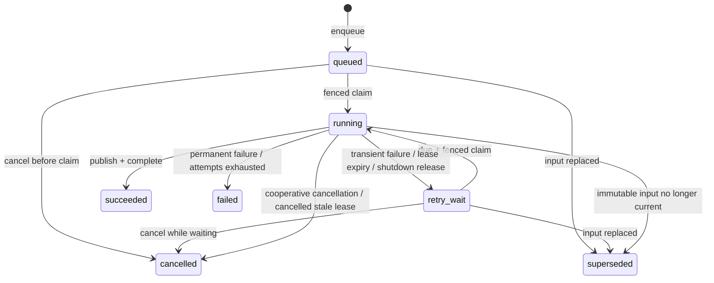

# Ingestion Job State Machine

## Status

- **Phase:** 0 architecture contract
- **Scope:** PostgreSQL-backed ingestion, reconciliation, maintenance, and reporting jobs
- **Authority:** The state and transition tables in this document are normative. Diagrams and SQL are explanatory.
- **Delivery:** This document defines behavior for later phases; it does not implement a queue or worker.

This contract refines the durable-job design in `TECHSTACK.md`. PostgreSQL is the only authority for whether work is pending, leased, retryable, cancelled, or complete. An in-memory worker queue may improve polling efficiency, but losing it must not lose work.

## 1. Delivery guarantee and terms

The queue provides **at-least-once execution**, not exactly-once execution. A worker can perform part or all of a handler more than once when it loses a lease, crashes after an external write, or cannot record completion. Correctness therefore comes from fenced leases, immutable inputs, deterministic operation keys, idempotent handlers, and repairable derived stores.

The following terms are used consistently:

- **Job:** A durable request such as `scan_location` or `index_file`.
- **Attempt:** One successful claim of a job by a worker. Claims, including a crash immediately after claim, consume an attempt.
- **Lease:** Time-bounded permission for one worker attempt to act for a job.
- **Lease token:** A new random UUID generated for every claim. It fences writes from stale attempts, including an earlier attempt made by the same worker instance.
- **Checkpoint:** Durable evidence that an idempotent handler step completed for a particular immutable input fingerprint.
- **Transient error:** An error that may succeed without changing the job request.
- **Permanent error:** An error that requires changed input, configuration, software, or an explicit operator decision.
- **Open job:** A job in `queued`, `running`, or `retry_wait`.
- **Terminal job:** A job in `succeeded`, `failed`, `cancelled`, or `superseded`.

Automatic retry reuses the same job and increments its attempt number. A manual retry always creates a new linked job.

## 2. Authoritative states

| Stored status | Terminal | Lease allowed | Meaning |
| --- | --- | --- | --- |
| `queued` | No | No | The job is ready to be claimed when `available_at <= database_now`. A newly created job starts here. |
| `running` | No | Yes, required | One attempt holds the current lease and may execute. Only writes bearing its current lease token are authoritative. |
| `retry_wait` | No | No | A prior attempt ended without completing and the job may be claimed after `available_at`. |
| `succeeded` | Yes | No | The requested authoritative result was published and required cleanup/checkpoints completed. |
| `failed` | Yes | No | A permanent error occurred or the automatic-attempt budget was exhausted. |
| `cancelled` | Yes | No | Cancellation won the state race. Partial, unpublished work may be cleaned up asynchronously. |
| `superseded` | Yes | No | The immutable input is no longer current, for example because a file changed during indexing. A current replacement job or scan request is linked or enqueued transactionally. |

`cancel_requested_at` is an intent flag, not another stored status. A running job with this flag is displayed as **Cancelling** while its stored status remains `running`. This avoids a state that looks unleased even though a worker must still reach a safe checkpoint.

Terminal rows are immutable except for explicitly non-semantic audit/retention metadata. No terminal row transitions back to an open state.



## 3. Authoritative transitions

Every transition of an existing job locks its row, uses PostgreSQL time, writes the current-state row, and appends the corresponding `job_events` row in the same database transaction. Creation atomically inserts the job and its first event. A transition not listed here is invalid.

| From | To | Trigger | Required guards and atomic effects | Required event |
| --- | --- | --- | --- | --- |
| none | `queued` | API, scheduler, or parent handler enqueues work | Validate job type and immutable payload; set `attempt_count=0`, `available_at`, lineage, dedupe key, and configured `max_attempts`; apply open-job uniqueness rules. | `job_enqueued` |
| `queued` | `running` | Worker claim | Job is due, not cancellation-requested, and under attempt limit. Acquire any required location lock; increment attempt exactly once; create lease owner/token/expiry and attempt record. | `attempt_started` |
| `retry_wait` | `running` | Worker claim | Same claim rules as above and `available_at <= database_now`. | `attempt_started` |
| `queued` | `cancelled` | User/system cancel | Row is locked; set cancellation and finish times; clear any scheduling fields. | `job_cancelled` |
| `retry_wait` | `cancelled` | User/system cancel | Same as queued cancellation. | `job_cancelled` |
| `running` | `succeeded` | Current worker completes | Lease owner/token match and lease is unexpired; no cancellation request exists; publish final SQL state and completion in one transaction; clear lease and set `finished_at`. | `job_succeeded` |
| `running` | `retry_wait` | Current worker reports a transient error | Lease is current; cancellation is absent; attempts remain. Close attempt, compute bounded backoff, set `available_at`, save safe structured error, and clear lease. | `retry_scheduled` |
| `running` | `retry_wait` | Graceful shutdown release | Lease is current and work stopped at a safe checkpoint; set `available_at=database_now`, clear lease, and retain consumed attempt count. | `attempt_released` |
| `running` | `retry_wait` | Reaper finds an expired lease | Row is locked, cancellation is absent, and attempts remain. Close attempt as lease-expired, apply retry backoff, and clear lease. | `lease_expired` and `retry_scheduled` |
| `running` | `failed` | Current worker reports a permanent error | Lease is current; record error class/code and finish; clear lease. | `job_failed` |
| `running` | `failed` | Transient error or expired lease exhausts attempts | `attempt_count >= max_attempts`; preserve the last error and identify exhaustion; clear lease and finish. | `attempts_exhausted` and `job_failed` |
| `running` | `cancelled` | Current worker acknowledges cancellation | Lease is current and cancellation was requested; stop before the next publication boundary, close attempt, clear lease, and finish. | `job_cancelled` |
| `running` | `cancelled` | Reaper finds an expired, cancellation-requested lease | Cancellation takes precedence over retry; clear lease and finish. | `lease_expired` and `job_cancelled` |
| `queued` or `retry_wait` | `superseded` | Reconciler proves immutable input is obsolete | Link/enqueue current replacement in the same transaction; finish old job. | `job_superseded` |
| `running` | `superseded` | Current attempt detects changed file/profile input | Lease is current; publish no mixed result; link/enqueue current replacement in the same transaction; clear lease and finish. | `job_superseded` |

Worker-initiated completion, failure, cancellation, and supersession use a compare-and-set guard on `(job_id, status='running', lease_owner, lease_token)` and require `lease_expires_at > database_now`. Updating zero rows means the worker lost authority and must stop without changing job or catalog state. Reaper transitions instead hold the row lock and require an expired lease.

## 4. Required durable data contract

The preliminary `ingestion_jobs` and `job_events` fields in `TECHSTACK.md` remain, with the following behavior and additions required by this contract.

### `ingestion_jobs` current-state row

Required fields include:

- Identity and routing: `id`, `job_type`, `priority`, `source_location_id`, `catalog_entry_id`, `payload_json`.
- State and timing: `status`, `requested_at`, `available_at`, `started_at`, `finished_at`.
- Attempts: `attempt_count`, `max_attempts`.
- Lease fencing: `lease_owner`, `lease_token`, `lease_expires_at`, `heartbeat_at`.
- Progress: `progress_phase`, `progress_current`, `progress_total`, `progress_unit`, `progress_message`, `progress_updated_at`.
- Error: `error_class`, `error_code`, sanitized `error_message`, and non-content `error_details_json`.
- Cancellation: `cancel_requested_at`, `cancel_requested_by`.
- Lineage: `retry_of_job_id`, `root_job_id`, `replacement_job_id`, and `origin` (`api`, `scheduler`, `handler`, `manual_retry`, or `maintenance`).
- Enqueue idempotency: `dedupe_key` and optional client `request_key`.
- Event ordering: `last_event_sequence`.

Lease fields are non-null only in `running`. Clearing a lease means setting owner, token, expiry, and current-job heartbeat fields to null after the attempt row captures their history. `finished_at` is non-null only for terminal jobs. `available_at` is meaningful for `queued` and `retry_wait`. Database constraints must enforce these invariants where practical.

Payloads are versioned, validated snapshots. They contain stable identifiers and input/profile fingerprints rather than mutable filesystem metadata that can silently change underneath a job. Secrets and document bodies never belong in a payload.

### `ingestion_job_attempts`

One row per claimed attempt preserves history that the current job row cannot:

- `(job_id, attempt_number)` unique key.
- `worker_id`, `lease_token`, `started_at`, `last_heartbeat_at`, `finished_at`.
- Outcome such as `succeeded`, `transient_error`, `permanent_error`, `cancelled`, `superseded`, `lease_expired`, or `shutdown_released`.
- Sanitized error code/class and timing/diagnostic metadata.

The claim transaction increments `attempt_count` from `N-1` to `N` and inserts attempt `N`. Enqueueing, an advisory-lock collision, or waiting does not consume an attempt. A claim committed immediately before a worker crash does consume one.

### `job_checkpoints`

A checkpoint is unique by `(job_id, checkpoint_name, input_fingerprint)` and records its completion time, attempt number, result identity, and safe metadata. Checkpoints are append-only or monotonically promoted from `started` to `completed`; a completed checkpoint is never silently rewritten for different input.

### `job_events`

Events are append-only and include `job_id`, monotonically increasing `sequence_number`, attempt number when applicable, type, level, actor/worker, database timestamp, safe message, and structured safe details. `(job_id, sequence_number)` is unique. The current-state mutation and its event share one transaction so the UI never sees an unexplained state.

Heartbeats update the attempt/job snapshots but do not create an event every time. Progress events are throttled. Lease acquisition/loss, state transitions, cancellation requests, retries, and checkpoint milestones are always events.

Event messages and details must exclude document text, prompts, credentials, database URLs, and raw exception traces. A correlation ID can point to a redacted local diagnostic log.

## 5. Claiming, leases, and stale-attempt fencing

### Claim transaction

Workers have a unique process-instance ID generated at startup. They select due work by priority and age. The implementation must use the equivalent of this single transactional pattern:

```sql
WITH candidate AS (
    SELECT id
    FROM ingestion_jobs
    WHERE status IN ('queued', 'retry_wait')
      AND available_at <= clock_timestamp()
      AND cancel_requested_at IS NULL
      AND attempt_count < max_attempts
    ORDER BY priority DESC, available_at ASC, requested_at ASC, id ASC
    FOR UPDATE SKIP LOCKED
    LIMIT 1
)
UPDATE ingestion_jobs AS job
SET status = 'running',
    attempt_count = job.attempt_count + 1,
    lease_owner = :worker_id,
    lease_token = gen_random_uuid(),
    heartbeat_at = clock_timestamp(),
    lease_expires_at = clock_timestamp() + :lease_duration,
    started_at = COALESCE(job.started_at, clock_timestamp())
FROM candidate
WHERE job.id = candidate.id
RETURNING job.*;
```

The attempt row and `attempt_started` event are inserted before the transaction commits. `SKIP LOCKED` allows competing workers to claim different rows without blocking. It does not replace the lease token and does not provide exactly-once execution.

All comparisons use PostgreSQL time to avoid Windows/container clock skew. Initial defaults are a 90-second lease and a heartbeat no slower than every 20 seconds; both are configurable by job type, and the heartbeat interval must remain below one third of the lease duration.

### Heartbeat

A heartbeat conditionally updates only the worker's current, unexpired lease:

```sql
UPDATE ingestion_jobs
SET heartbeat_at = clock_timestamp(),
    lease_expires_at = clock_timestamp() + :lease_duration
WHERE id = :job_id
  AND status = 'running'
  AND lease_owner = :worker_id
  AND lease_token = :lease_token
  AND lease_expires_at > clock_timestamp()
RETURNING cancel_requested_at, lease_expires_at;
```

Zero rows means the lease is lost; a late heartbeat cannot resurrect it. The worker must stop at the next safe boundary and may not checkpoint, publish catalog changes, or mark completion. Heartbeat execution must be independent of a long extraction/hash operation, or those operations must be broken into bounded units so the worker can maintain its lease.

### Lease expiry and reaping

A reaper periodically locks expired `running` rows with `FOR UPDATE SKIP LOCKED`. It closes the attempt and follows the authoritative transition table: cancellation first, retry with backoff second, terminal failure when attempts are exhausted. The reaper clears lease fields. A normal claimant never steals a row still stored as `running`.

At worker startup, stale-lease reaping runs before normal claims. More than one reaper may run because row locking makes each expiry transition single-writer.

## 6. Retry and error policy

### Attempt budget and backoff

`max_attempts` is snapshotted when the job is created and is at least one. Automatic retries use the same job. For completed attempt number `n`:

```text
cap(n)   = min(max_delay, base_delay * 2^(n - 1))
delay(n) = uniform(cap(n) / 2, cap(n))
available_at = database_now + delay(n)
```

This equal-jitter policy avoids synchronized retries while preserving an upper bound. Initial defaults are `base_delay=5 seconds` and `max_delay=15 minutes`, with job-type overrides for slow NAS recovery. Tests inject a seeded random source and database clock. A trustworthy service `Retry-After` may increase the delay within an operator-configured maximum; it never resets the attempt count.

### Error classes

| Class | Examples | Automatic behavior |
| --- | --- | --- |
| `transient` | NAS temporarily unavailable, Windows sharing violation, network timeout, PostgreSQL serialization/deadlock, retryable Qdrant timeout/429/5xx, temporary disk pressure | Retry with bounded backoff while attempts remain. Preserve existing catalog/vector state. |
| `permanent` | Unsupported/encrypted/malformed document, OCR required, path escape, file/page/size limit, invalid immutable payload, incompatible profile | Fail immediately and expose a safe actionable code. A later manual retry is a new job. |
| `superseded` | File fingerprint changed, catalog entry moved to a newer observed version, requested profile was retired/replaced | Publish no mixed state; terminally supersede and enqueue/link current work. Does not consume another automatic attempt. |
| `cancelled` | User/system cancellation observed at a safe boundary | Cancel; never auto-retry. |

Unknown exceptions use `internal_unclassified`, are retried only within a small bounded attempt budget, and then become `failed`. They are never retried indefinitely. Programmer/data-invariant violations may be classified permanent immediately. The mapping from exception/error code to class is centralized and covered by tests.

## 7. Cancellation and manual retry

### Cancellation

Cancellation requests are idempotent and serialized by locking the job row:

- `queued` or `retry_wait`: transition directly to `cancelled`.
- `running`: set `cancel_requested_at` once and append `cancellation_requested`. The worker learns this from heartbeat/polling and checks before and after every checkpoint and before final publication.
- terminal: return the existing terminal state without mutation.

Cancellation is cooperative; the service does not report `cancelled` while an uninterruptible operation is still authoritative. Extractors and external calls must have timeouts so cancellation is eventually observed.

Final publication and cancellation both lock the same row. If cancellation is recorded first, the completion transaction must not publish and cancellation wins. If publication and `succeeded` commit first, a later cancellation is a no-op. A lease that expires after cancellation is terminally cancelled by the reaper rather than retried.

Operator shutdown is not user cancellation. It releases the attempt to `retry_wait` when possible or lets the lease expire.

### Manual retry

`POST /jobs/{id}/retry` is valid for `failed` and `cancelled` jobs. It creates a new `queued` row with:

- a new job ID and `attempt_count=0`;
- `retry_of_job_id` pointing to the selected terminal job;
- `root_job_id` copied from the source, or set to the source ID if this starts the lineage;
- a validated payload snapshot and current configured attempt policy;
- no copied lease, progress, cancellation, error, or job-specific checkpoint state.

The original job remains immutable. The new handler can still reuse content-addressed artifacts, canonical SQL objects, deterministic chunks, and Qdrant points.

The retry API uses a client request key for HTTP idempotency. Independently, a partial uniqueness rule permits at most one open manual-retry child for a given source job; concurrent clicks return the existing child. Retrying a `succeeded` job is not allowed—explicit re-index creates a distinct job with re-index semantics. `superseded` already has replacement lineage and is not manually retried.

## 8. Per-location scan exclusivity

There must be at most one open `scan_location` job per source location. PostgreSQL enforces this under concurrent scheduler/API requests with an equivalent partial unique index:

```sql
CREATE UNIQUE INDEX one_open_scan_per_location
ON ingestion_jobs (source_location_id)
WHERE job_type = 'scan_location'
  AND status IN ('queued', 'running', 'retry_wait');
```

The enqueue transaction returns the existing open scan when the insert loses this race. Scheduler ticks therefore coalesce; they do not form an unbounded backlog.

To serialize active scan attempts, a scan worker also acquires a session-level PostgreSQL advisory lock derived from the stable source-location ID before committing its claim and holds it on a dedicated connection through the attempt. Failure to acquire this lock does not consume an attempt. Connection/process death releases the lock. Hash collisions may conservatively serialize unrelated locations but must never allow the same location to overlap.

Lease fencing remains authoritative: a stale worker may finish a read-only filesystem call after lease loss, but it cannot publish observations or reconciliation changes. Scan observations are staged under `(scan_job_id, attempt_number, lease_token)`. Missing-file reconciliation occurs only in one final transaction after all of the following are true:

1. enumeration completed successfully;
2. the mapped-drive sentinel and configured UNC/share identity remained valid;
3. the source did not become unavailable;
4. cancellation was not requested; and
5. the worker still owns the unexpired lease and location lock.

An incomplete, failed, cancelled, or stale scan never marks unseen files missing and never deletes vectors. Its staging rows are invisible to catalog readers and are removed after a grace period.

## 9. Handler idempotency and checkpoints

Progress and events are observability, not correctness checkpoints. A handler may skip a step only after validating a completed durable checkpoint and the step's immutable input fingerprint.

Every mutation uses an operation-specific idempotency key or database uniqueness constraint. The baseline `index_file` boundaries are:

1. Validate location, current file observation, source sentinel, and profile fingerprints.
2. Stream file SHA-256; checkpoint the hash only if the observed size/mtime/identity still match.
3. Extract and normalize; write a checksummed temporary artifact, then atomically rename to its content-addressed final name.
4. Upsert canonical content and deterministic chunks under SQL uniqueness constraints.
5. Upsert Qdrant points using deterministic point IDs. Repeating an upsert replaces the same points.
6. Record vector/checkpoint results, catalog references, and indexed status in a fenced SQL transaction.

A checkpoint is recorded only after its durable effect succeeds. Before using it, the handler verifies the artifact checksum, content/profile identity, or expected vector identity as applicable.

PostgreSQL and Qdrant do not share a distributed transaction. If a worker crashes after Qdrant upsert but before SQL publication, retry repeats the deterministic upsert. Orphan-point cleanup and the catalog/vector consistency checker repair any remainder. SQL never claims a vector publication that did not complete.

Other handlers follow the same rules:

- Scan results stay in attempt-scoped staging until a fenced final reconciliation transaction.
- Cleanup uses deterministic target IDs and rechecks SQL references before deletion.
- Duplicate reports and sync plans are built under a versioned run ID and atomically promoted only when complete.
- Manual-retry jobs do not inherit job checkpoints, but naturally reuse validated domain objects and deterministic external effects.

## 10. Progress contract

Progress describes the current attempt:

- A claim resets the attempt's phase/current/total fields. Attempt history remains in events/attempt rows.
- Within one `(job_id, attempt_number, progress_phase)`, `progress_current` is non-negative and monotonic.
- `progress_total` is nullable while discovery is open. Once known, it is non-decreasing and never below current.
- A phase change may start a new phase counter at zero; the UI labels the phase and attempt so this is not presented as regression.
- Progress updates require the current lease token and are ignored/rejected after lease loss.
- Writes are throttled (normally no more than once per second) except for phase changes, warnings, and terminal transitions.
- `succeeded` sets a completed phase and, when total is known, `current=total`.

Examples of units are `files_discovered`, `files_hashed`, `pages_extracted`, `chunks_embedded`, and `points_upserted`. Messages are short controlled strings and never include document content. Progress may be approximate and must not be used to decide whether a side effect can be skipped.

## 11. Shutdown and recovery invariants

On graceful shutdown a worker:

1. enters draining mode and stops claiming jobs;
2. continues heartbeating current attempts;
3. asks handlers to stop after the nearest safe checkpoint;
4. conditionally releases each owned job to `retry_wait` with `available_at=database_now`; and
5. releases location advisory locks and closes connections.

If the grace deadline expires, the process exits without forging a terminal state. Leases expire and the reaper recovers the jobs. On startup, the worker gets a new worker ID, reaps stale leases, and only then starts claiming.

The following invariants hold through API, worker, container, Windows, or host restart:

- Every uncompleted request is represented by an open PostgreSQL row.
- At most one unexpired lease token is authoritative for a job.
- A stale attempt cannot heartbeat, checkpoint, publish, cancel, fail, or complete a newer attempt.
- Attempt count never decreases and increments exactly once per committed claim.
- Terminal jobs have no lease and never transition in place.
- A transient failure is either scheduled for retry or terminally exhausted; it is never silently lost.
- Cancellation is never converted into an automatic retry.
- An incomplete/unavailable location scan cannot cause missing-file or vector deletion.
- Repeating any handler step converges on the same SQL/artifact/Qdrant result.
- Any cross-store partial result is detectable and repairable from PostgreSQL plus source/artifact authority.

If PostgreSQL becomes unavailable, the worker cannot renew authority. It stops starting new external batches, bounds any in-flight call, and performs no catalog publication until it can prove that its lease is still current.

## 12. Acceptance scenarios

These scenarios are mandatory automated tests in the phase that implements the queue. Tests use a controllable database clock where feasible, seeded jitter, synthetic documents, and stubbed external stores.

| Scenario | Given / When | Required result |
| --- | --- | --- |
| Competing claims | Two workers claim the same due job concurrently. | Exactly one claim transaction returns that job; its attempt becomes 1 and one `attempt_started` event/attempt row exists. The other worker can claim another unlocked job. |
| Claim crash recovery | A worker commits a claim and dies before handler work. | After lease expiry the reaper schedules the same job; the next claim is attempt 2. No work is lost. |
| Healthy heartbeat | A worker heartbeats before one-third of each lease period while a reaper runs. | Lease expiry advances and no other worker can claim/reap the job. |
| Stale fencing | Attempt 1 expires and attempt 2 is claimed; attempt 1 then sends heartbeat/progress/completion. | Every stale update affects zero rows. Only attempt 2 can publish or terminate the job. |
| Transient backoff | Attempt 1 reports a transient NAS/Qdrant error with seeded jitter. | Job enters `retry_wait`, `available_at` matches the formula, and it cannot be claimed early. |
| Permanent failure | A handler reports `ocr_required` or invalid path escape. | Job becomes `failed` immediately with a safe code and no automatic retry. |
| Attempt exhaustion | The last allowed attempt reports transient failure or expires. | Job becomes `failed`, emits `attempts_exhausted`, and is never automatically claimed again. |
| Cancel before claim | The API cancels a queued or retry-waiting job twice. | One transition/event occurs, both requests return `cancelled`, and no worker can claim it. |
| Cancel during work | A running handler receives cancellation between checkpoints. | UI derives Cancelling, handler publishes no later boundary, then fenced transition produces `cancelled`; reaper never retries it. |
| Completion/cancel race | Completion and cancellation transactions run concurrently. | Row locking yields exactly one outcome: committed success makes later cancel a no-op; prior cancellation prevents publication and leads to cancellation. |
| Manual retry lineage | Two concurrent retry requests with the same request key target a failed job. | One new queued child is created with attempt 0 and correct root/parent linkage; the original remains failed. |
| Scheduler coalescing | API and scheduler concurrently enqueue scans for one location. | The partial unique rule leaves one open scan job and all callers receive that job identity. |
| Scan execution exclusivity | Two workers encounter scan work for one location, including a stale lease case. | Only the holder of the location lock and current lease can reconcile; no overlapping authoritative publication occurs. |
| Interrupted NAS scan | The mapped source disappears after partial enumeration. | Scan retries/fails visibly; no unseen catalog entry becomes missing and no vector is deleted. |
| Changed file mid-index | Fingerprint changes after extraction but before publication. | Old job is `superseded`, mixed state is not published, and a replacement/current observation is linked or queued. |
| Qdrant write crash | Worker upserts deterministic points and crashes before SQL checkpoint. | Retry upserts the same point IDs, then publishes SQL once; no duplicate points result. |
| Progress fencing | Current and stale attempts update progress, including decreasing values. | Stale/decreasing updates are rejected; phase-local progress remains monotonic and events are throttled. |
| Audit atomicity | Each state transition is read immediately after commit. | Its ordered event is visible in the same snapshot; event sequences have no duplicate numbers. |
| Graceful shutdown | Worker receives termination while processing a checkpointable job. | It claims no new work, safely releases current work to immediate `retry_wait`, and the next worker resumes idempotently with a new attempt. |
| Hard kill | Worker is killed during extraction or scan staging. | No terminal success or partial catalog reconciliation appears; expiry and retry recover the job, and stale staging is later cleaned. |

## 13. Phase boundaries

Phase 2 implements the schema, claims, attempts, leases, heartbeat, cancellation, retry policy, events, scan exclusivity, and worker/reaper behavior defined here. Handler-specific checkpoints arrive with their corresponding scanner, extraction, Qdrant, duplicate, and sync-plan phases. Phase 8 validates graceful shutdown, stale-lease recovery under forced process termination, cleanup grace periods, and operational tuning.

Changing the stored states, delivery guarantee, fencing mechanism, cancellation race rule, or scan-exclusivity invariant requires an architecture decision record and migration plan.
